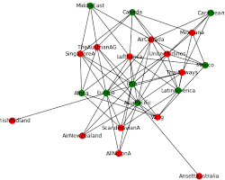

# Understanding LeetCode Problems

This document serves as a guide to understanding LeetCode problems and the concept of Network Delay Time. It includes a breakdown of the Network Delay Time problem and outlines potential approaches to solve it.

## What is LeetCode?

LeetCode is a popular online platform for programmers to practice coding skills through a variety of coding challenges. These challenges cover various data structures, algorithms, and problem-solving techniques.

## Network Delay Time Problem

Given a network of `n` nodes linked by directed edges, where each edge represents a connection with a specific travel time. You are also given a source node `k`. The problem asks to find the minimum time it takes for a signal sent from `k` to reach all other nodes in the network. If it's impossible for all nodes to receive the signal, the output is -1.

### Visualizing the Network


### Approaching Network Delay Time

A common approach to solve this problem involves using Dijkstra's algorithm. This algorithm helps find the shortest paths between a starting node and all other nodes in a weighted graph (where each edge has a weight representing the travel time).

### Key Steps

1. **Representing the Network:** Utilize an adjacency list or adjacency matrix to represent the network connections and travel times.
2. **Initializing Distances:** Set the initial distance to all nodes as infinity except for the source node `k`, which is set to 0.
3. **Priority Queue:** Employ a min-heap to efficiently track nodes with their current minimum distances.
4. **Dijkstra's Algorithm:**
   * Repeat until the heap is empty:
     * Extract the node with the minimum distance from the heap.
     * If the node is already visited, skip it.
     * Mark the node as visited.
     * For each neighbor of the current node:
       * Calculate the new distance to the neighbor by adding the travel time of the connecting edge to the current distance.
       * If the new distance is less than the current distance to the neighbor:
         * Update the distance and push the neighbor into the min-heap.
5. **Finding Minimum Time:** Return the maximum distance among all nodes in the network. If there are unreachable nodes, return -1.

This approach guarantees finding the minimum time for the signal to reach all reachable nodes in the network.

### Additional Resources

* [LeetCode Platform](https://leetcode.com/) - You can find practice problems related to Network Delay Time.
* [Explanation of Dijkstra's Algorithm](https://en.wikipedia.org/wiki/Dijkstra%27s_algorithm)

## Cheapest Flights with K Stops

### Problem

Find the cheapest price for a flight from a source city to a destination city with at most K stops. If there is no such route, output -1.

#### Example
Input: n = 3, flights = [[0,1,100],[1,2,100],[0,2,500]], src = 0, dst = 2, k = 1
Output: 200
Explanation:
Cheapest flight from city 0 to city 1 is 100, then from city 1 to city 2 is 100, total cost is 200.


### Approach

* Use Dijkstra's algorithm with a modified priority queue to keep track of the number of stops.
* Explore all possible paths with at most K stops.
* Update the minimum cost to reach a city if a shorter path is found.

### Visualizing the Flight Network



### Code

The code for the solution can be found in `solution.py` (or your preferred language).

### Time and Space Complexity

* **Time complexity:** O(E * log V), where E is the number of edges and V is the number of vertices.
* **Space complexity:** O(E + V)

## Finding the City with the Smallest Number of Neighbors

### Problem Statement

Given a graph representing cities and distances between them, find the city with the smallest number of neighbors within a given distance threshold.

### Approach

To solve this problem, we'll follow these steps:

1. **Construct the graph:** Represent cities as nodes and distances as weighted edges.
2. **Calculate distances:** Use Dijkstra's algorithm to compute the shortest distances between all pairs of cities.
3. **Count neighbors:** Determine the number of neighbors for each city within the given distance threshold.
4. **Find the city:** Identify the city with the smallest number of neighbors.

### Algorithm

**Dijkstra's Algorithm:**
* Initialize distances to all nodes as infinity except for the starting node.
* Create a min-heap to store nodes and their tentative distances.
* While the min-heap is not empty:
  * Extract the node with the minimum distance.
  * For each neighbor of the extracted node:
    * Calculate the tentative distance to the neighbor.
    * If the new distance is less than the current distance, update it.

**Neighbor Counting:**
Iterate through each city, counting the number of cities within the given distance threshold.

### Time and Space Complexity

* **Time complexity:** O(N^3) due to Floyd-Warshall (can be optimized using Dijkstra's)
* **Space complexity:** O(N^2) for the distance matrix

### Code Structure

The code will be organized into the following functions:
* `build_graph(edges)`: Constructs the graph from given edges.
* `dijkstra(graph, src)`: Implements Dijkstra's algorithm to find shortest distances from a source node.
* `count_neighbors(distances, threshold)`: Counts neighbors for each city within the threshold.
* `find_city_with_min_neighbors(counts)`: Finds the city with the smallest number of neighbors.

### Example Usage

```python
edges = [(0, 1, 2), (0, 2, 3), (1, 2, 1), (1, 3, 4)]
distance_threshold = 2
result = find_city(4, edges, distance_threshold)
print(result)  # Output: 3
