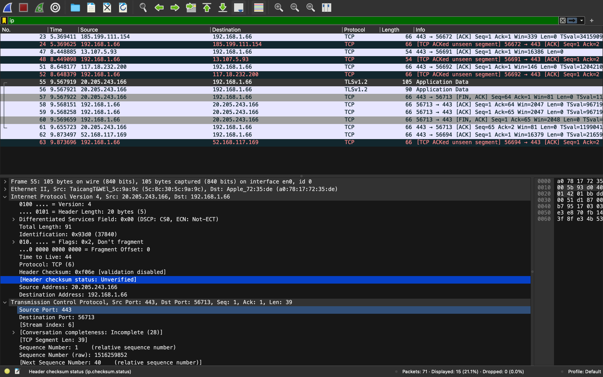

# Analysis of  IP headers

## Capturing IP Packets in Wireshark

We filtered IP packets in wireshark with ```ip``` filter.

# IPv4 Header Analysis

This document provides an analysis of the IPv4 headers captured during a network packet capture session. The focus is on understanding the structure and key fields of the IPv4 header, along with insights into how these fields are used in network communication.

## 1. Overview of IPv4 Header

The IPv4 header is typically 20 bytes in length (without options) and contains several fields that are essential for routing and delivering packets across an IP network. Below is a breakdown of each field and its significance.

### 1.1. IPv4 Header Structure

| Field Name        | Size (bits) | Description |
|-------------------|-------------|-------------|
| Version           | 4           | Specifies the IP version. For IPv4, this value is `4`. |
| Header Length     | 5           | Indicates the length of the IPv4 header in 32-bit words. The minimum value is `5` (20 bytes). |
| Differentiated Services (DSCP) | 6 | Used to classify and manage network traffic. It replaces the Type of Service (ToS) field in the original IPv4 specification. |
| ECN (Explicit Congestion Notification) | 2 | Provides feedback on network congestion to avoid packet loss. |
| Total Length      | 16          | Specifies the total length of the IP packet (header + data) in bytes. The maximum value is 65,535 bytes. |
| Identification    | 16          | Identifies fragments of the original packet. All fragments of a packet will have the same identification number. |
| Flags             | 3           | Controls or identifies fragments. The key flags are: `DF (Don't Fragment)` and `MF (More Fragments)`. |
| Fragment Offset   | 13          | Indicates the position of a fragment in the original packet. Measured in 8-byte blocks. |
| Time to Live (TTL)| 8           | Specifies the maximum number of hops (routers) the packet can pass through before being discarded. Prevents routing loops. |
| Protocol          | 8           | Indicates the protocol used in the data portion of the IP packet (e.g., `6` for TCP, `17` for UDP). |
| Header Checksum   | 16          | Provides error-checking for the header. If the checksum is incorrect, the packet is discarded. |
| Source Address    | 32          | The IP address of the originator of the packet. |
| Destination Address | 32        | The IP address of the intended recipient of the packet. |
## 2. Detailed Analysis of Captured IPv4 Packets

### 2.1. Example IPv4 Packet

Below is a detailed analysis of an example IPv4 packet captured during the session.

- **Version**: `4`
  - Indicates the packet uses IPv4.
  
- **Header Length**: `5` (20 bytes)
  - The header length is 20 bytes, meaning there are no optional fields.

- **Differentiated Services (DSCP)**: `0x00`
  - No special traffic classification applied.

- **ECN**: `0x00`
  - No explicit congestion notification.

- **Total Length**: `91 bytes`
  - The total size of the packet, including both header and data, is 60 bytes.

- **Identification**: `0x93d0`
  - A unique identifier for this specific packet.

- **Flags**: `0x2` (DF - Don't Fragment)
  - The packet should not be fragmented.

- **Fragment Offset**: `0`
  - This packet is not fragmented.

- **Time to Live (TTL)**: `44`
  - The packet can traverse up to 64 routers before being discarded.

- **Protocol**: `6` (TCP)
  - The data portion of the packet contains a TCP segment.

- **Header Checksum**: `0xf06e`
  - A checksum used to verify the integrity of the header.

- **Source Address**: `20.205.243.166`
  - The packet originated from IP address `20.205.243.166`.

- **Destination Address**: `192.168.1.66`
  - The packet is intended for IP address `192.168.1.66`.

### 2.2. Common Observations

- **Fragmentation**:
  - Most of the captured packets were not fragmented, indicating that they were small enough to fit within the standard MTU size for Ethernet (1500 bytes).

- **TTL Values**:
  - The TTL values varied between packets, reflecting different numbers of hops between the source and destination. Typically, a TTL of 64 or 128 is observed, depending on the operating system.

- **Protocol Distribution**:
  - The majority of the packets captured used the TCP protocol, which is consistent with typical web browsing and application usage.

## 3. Conclusion

The analysis of IPv4 headers provides valuable insights into the functioning and structure of IP-based communication. By understanding the significance of each field in the IPv4 header, network engineers and analysts can diagnose issues, optimize traffic flow, and ensure reliable data transmission across networks.
