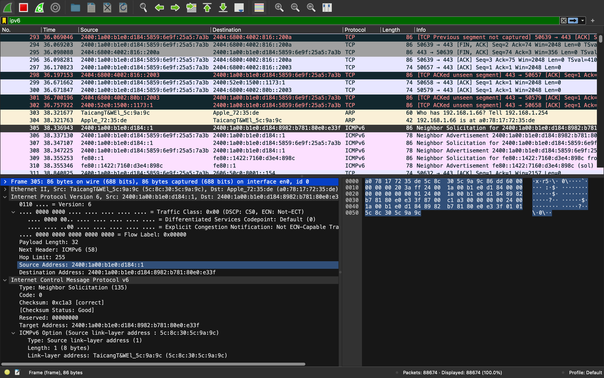

## Understanding IPV6 headers
IPv6 (Internet Protocol version 6) is the latest version of the Internet Protocol (IP), designed to replace IPv4 due to the exhaustion of IPv4 addresses. The IPv6 header has been simplified and optimized compared to its predecessor, making packet processing more efficient.

### Capturing IPv6 Headers

IPv6 is filtered by typing ipv6 in search bar
1. **Version (4 bits)**:
   - Indicates the IP version. For IPv6, this value is always `6`.
2. **Traffic Class (8 bits)**:
   - It is a 8-bit field.The first 6 bits are typically used for DSCP, which is a part of the Differentiated Services (DiffServ) model. By setting the appropriate values in the Traffic Class field, network devices can prioritize packets, ensuring that critical services (like VoIP or streaming video) receive the necessary bandwidth and low latency, even during periods of network congestion
   -  The remaining 2 bits are used for ECN, which provides information about network congestion to help reduce packet loss and improve overall network performance
3. **Flow label (20bit)**:
   - The Flow Label field in an IPv6 header is a 20-bit field used to identify packets that belong to the same flow. A flow is a sequence of packets sent from a source to a destination that requires special handling by the network, such as maintaining a specific quality of service (QoS) level
4. **Payload Length (16 bits)**:
    - The Payload Length field in an IPv6 header is a 16-bit field that specifies the size of the payload carried by the IPv6 packet. The payload includes everything that follows the IPv6 header, such as any extension headers and the data from higher-layer protocols (e.g., TCP, UDP).
5. **Next Header (8 bits)**:
    - The Next Header field in an IPv6 header is an 8-bit field that identifies the type of header that immediately follows the IPv6 header.
    Here is ICMPv6(58) which is  used for diagnostic and error-reporting messages in IPv6
6. **Hop Limit (8 bits)**:
   - Similar to the Time to Live (TTL) field in IPv4, it defines the maximum number of hops (routers) a packet can pass through before being discarded. This field is decremented by one at each hop.

7. **Source Address (128 bits)**:
   - The IPv6 address of the packet's origin. It is 128 bits long, allowing for a vastly larger address space than IPv4.Here source address is  2400:1a00:b1e0:d184::1

8. **Destination Address (128 bits)**:
   - The IPv6 address of the packet's intended recipient. Like the source address, it is also 128 bits long.Here the destination address is 2400:1a00:b1e0:d184:8982:b781:80e0:e33f

