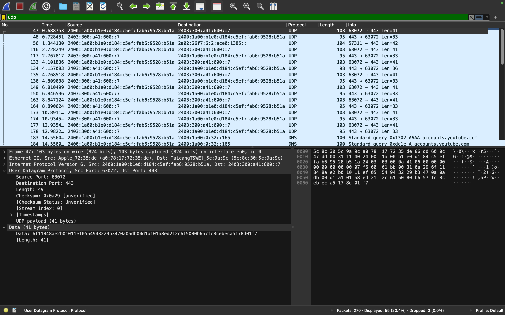

# UDP Header Analysis

This document provides an analysis of the UDP (User Datagram Protocol) headers captured during a network packet capture session. The focus is on understanding the structure and key fields of the UDP header, along with insights into how these fields are used in network communication.

## 1. Overview of UDP Header

The UDP header is a simple, fixed-length header that is 8 bytes (64 bits) in size. UDP is a connectionless protocol, meaning it does not establish a connection before sending data, and does not guarantee delivery, order, or error correction. Below is a breakdown of each field in the UDP header and its significance.

### 1.1. UDP Header Structure

| Field Name       | Size (bits) | Description |
|------------------|-------------|-------------|
| Source Port      | 16          | The port number of the sender. This field identifies the sending application. |
| Destination Port | 16          | The port number of the receiver. This field identifies the receiving application. |
| Length           | 16          | Specifies the length of the UDP header and the data. The minimum value is 8 bytes (header only). |
| Checksum         | 16          | Used for error-checking of the header and data. It is optional in IPv4 but mandatory in IPv6. |

## 2. Detailed Analysis of Captured UDP Packets

Below is a detailed analysis of an  UDP packet captured during the session.

- **Source Port**: `63072`
  - The packet originated from port `63072`. This is typically an ephemeral port, used by the client-side application.
  
- **Destination Port**: `443` (DNS)
  - The packet is directed to port `443`, which is commonly used for DNS queries.

- **Length**: `49 bytes`
  - The total length of the UDP segment (header + data) is 49 bytes. This includes the 8-byte header and 20 bytes of data payload.

- **Checksum**: `0x0a29`
  - The checksum value is used to verify the integrity of the UDP segment. The receiving end uses this value to detect any errors in transmission.

## 3. Conclusion

The analysis of UDP headers provides a clear understanding of how connectionless data transmission occurs over IP networks. By examining the source and destination ports, length, and checksum fields, network analysts can gain insights into the type of traffic and ensure that communication is occurring as expected.

UDP is ideal for applications where speed is critical, and the occasional loss of packets is acceptable. Understanding the structure of UDP headers helps in diagnosing issues related to these types of network communications.
