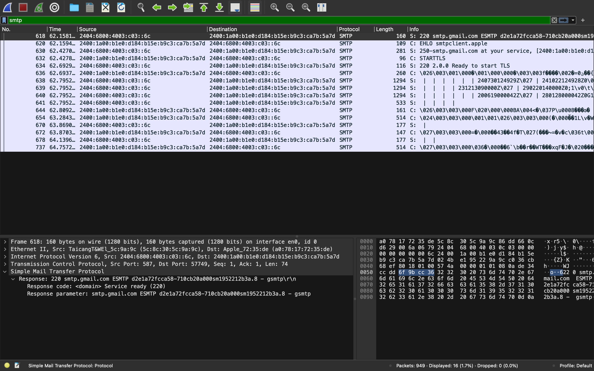
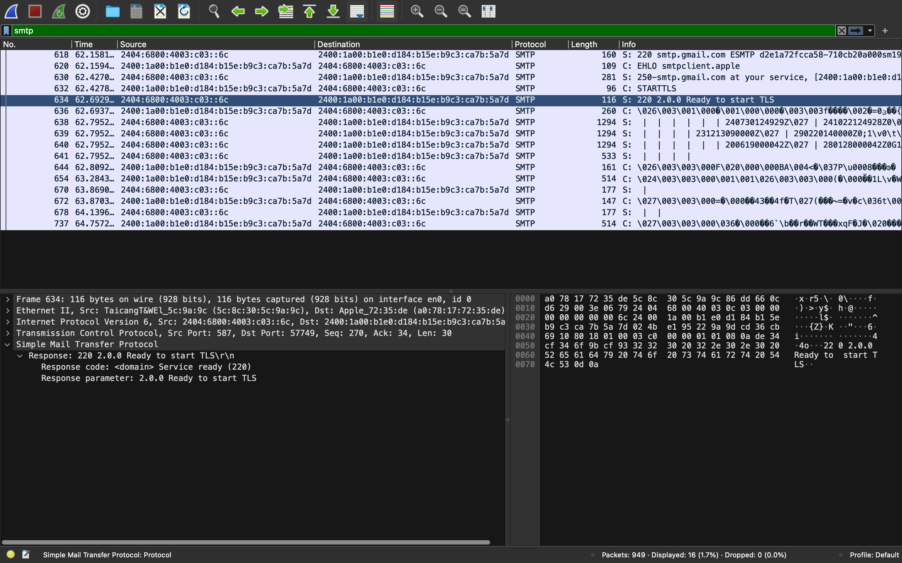

We filtered the SMTP packets with smtp filter in wireshark.

## Steps involved in SMTP communication 

### TCP Handshake 

Before any SMTP communication happens, a TCP connection is established between the client and the server. This involves the typical three-way handshake (SYN, SYN-ACK, ACK) at the Transport Layer (Layer 4 of the OSI model).

The SMTP server, upon accepting the TCP connection, sends a greeting message to the client. This message is an SMTP ```220``` response code, indicating that the server is ready to proceed with communication.

### Client EHLO Command


After getting ```220``` client makes ```EHLO``` to smtpclient.apple


### Server EHLO Response

Server send the EHLO response with following headers
#### Response: 250-smtp.gmail.com at your service, [2400:1a00:b1e0:d184:b15e:b9c3:ca7b:5a7d]
- **250**: This is the response code indicating that the requested mail action is okay and completed.
- **smtp.gmail.com at your service**: The domain of the SMTP server with a friendly message from the server.
- **[2404:7c00:4a:54c1:48c0:1210:c9ac:3a94]**: The client's IP address in IPv6 format.

#### Response parameters:
- **SIZE 35882577**: The maximum message size the server is willing to accept.
- **8BITMIME**: Indicates support for 8-bit MIME encoding.
- **STARTTLS**: Indicates support for upgrading to a secure connection using TLS.
- **ENHANCEDSTATUSCODES**: Indicates support for enhanced status codes.
- **PIPELINING**: Indicates support for command pipelining, allowing multiple commands to be sent without waiting for individual responses.
- **CHUNKING**: Indicates support for the BDAT command, which allows the message to be sent in chunks.
- **SMTPUTF8**: Indicates support for the SMTPUTF8 extension, allowing UTF-8 encoding in email addresses and headers.

### Client STARTTLS Command

Client sending STARTTLS command to SMTP server

**STARTTLS**: Command issued by the client to initiate a transition from an unencrypted connection to an encrypted connection using TLS.


### Server STARTTLS Response

#### Response: 220 2.0.0 Ready to start TLS
- **220**: This is the response code indicating that the server is ready to proceed with the next command.
- **2.0.0 Ready to start TLS**: A message indicating that the server is ready to start the TLS handshake process.

### Final Step
At final step, actual mail is sent over encrypted channel if TLS handshake is completed successfully. 